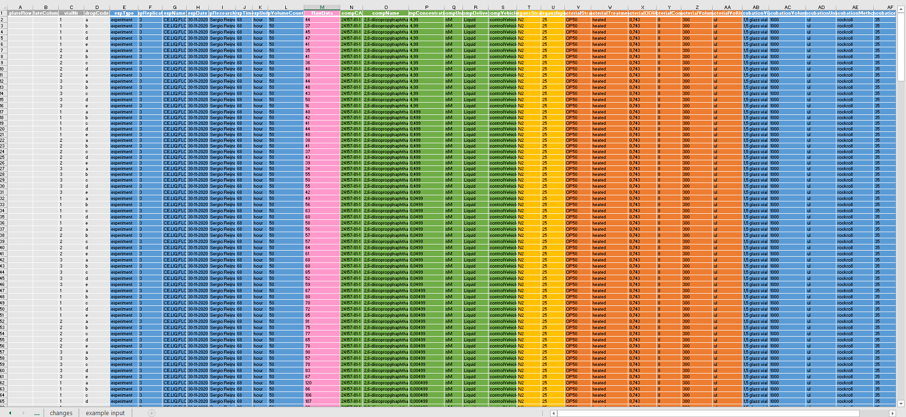

C. elegans plate experiment {.unnumbered}
================================================================================
The data for this exercise was kindly supplied by J. Louter (INT/ILC) and was derived from an experiment in which adult C.elegans nematodes were exposed to varying concentrations of different compounds. The variables RawData (the outcome - number of offspring counted as an integer value, after incubation time), compName (the generic name of the compound/chemical), the compConcentration (the concentration of the compound), and the expType are the most important variables in this dataset.
<br> <br>
A typical analysis with this data would be to run a dose-response analysis using a log-logistic model with estimates for the maximal, the minimal, the IC50 concentration and the slope at IC50. We will not go into the details but a good package to run such computations and create graphs in R is the {drc} package. 
<br> <br> <br>
Lets have a look at the excel file containing the data. 
<br>
 
<br>
We can see that someone put a lot of care into the make-up of the sheet and it is still difficult to read. 
<br> <br>
Now lets open the Excel file in R and render the first five rows.
```{r 1.1.b, message = FALSE, warning = FALSE}
scatter_FLOW.062 <- read_excel('data/data_raw/CE.LIQ.FLOW.062_Tidydata.xlsx') 
knitr::kable( scatter_FLOW.062 %>% head(5))
```
<br> <br> 
And have a look at the data types.
```{r 1.1.c, message = FALSE, warning = FALSE}
scatter_FLOW.062 %>% select(RawData, compName, compConcentration) %>% head(1)
```
<br>
When we have a look at some of the data types of the collumns RawData, compName and compConcentration (see above) we would expect them to be dbl, chr and dbl. compConcentration however, has the datatype chr. This means it was imported incorrectly.
<br> <br>
Next we will create a scatterplot graph with the data for the different compounds and the varying concentrations. 
<br>
To do this I first fixed the compConcentration column by making it numeric, put the compConcentration on the x-axis, the RawData counts on the y-axis and assigned a color to each level in compName. I also assigned a different symbol to each level by the expType variable.
```{r 1.1.d, message = FALSE, warning = FALSE}
# Transform the datatype of compConcentration to dbl
scatter_FLOW.062 <- scatter_FLOW.062 %>% transform(compConcentration = as.double(compConcentration))

# Plotting data using ggplot
scatter_FLOW.062 %>% ggplot(aes(x = compConcentration, y = RawData)) + 
  geom_point(aes(colour = compName, shape = expType)) + 
  labs(title = "Compound RawData per compound concentration",
       caption = "Data supplied by J. Louter (INT/ILC)") 
```
<br> <br>
If I would not have changed the data type of the compConcentration column this would have happened:
```{r 1.1.e, message = FALSE, warning = FALSE}
# Show example of the wrong graph gotten from .xlsx format by retrieving data and plotting it
wrong_scatter_FLOW.062 <- read_excel('data/data_raw/CE.LIQ.FLOW.062_Tidydata.xlsx')

wrong_scatter_FLOW.062 %>% ggplot(aes(x = compConcentration, y = RawData)) + 
  geom_point(aes(colour = compName, shape = expType)) + 
  labs(title = "Compound RawData per compound concentration",
       caption = "Data supplied by J. Louter (INT/ILC)") 
```
<br>
Every concentration is seen as a separate point because the column has the 'chr' type.
<br> <br>
Now, with the correct data types we will tweak the graph using a log10 transformation on the x-axis to get a clear graph. I also added a bit of jitter to prevent the points in the graph from overlapping.
```{r 1.1.f, message = FALSE, warning = FALSE}
# Plot data using log10 function in ggplot
scatter_FLOW.062 %>% ggplot(aes(x = compConcentration, y = RawData)) + 
  geom_point() + 
  geom_jitter(aes(colour = compName, shape = expType), width = 0.5) +
  scale_x_log10() +
  labs(title = "Compound RawData per compound concentration",
       caption = "Data supplied by J. Louter (INT/ILC)") 
```
<br>
The positive control for this experiments is ethanol. The negative control for this experiment is S-medium.
<br> <br>
To analyze this experiment and learn whether there is indeed an effect of different concentrations on offspring count and whether the different compounds have a different curve (IC50) I would take these steps:
<br>
- Group the data for every compound. <br>
- Check if the data is normally distributed. <br>
- Use the apropriate statistical tests on the data to see if there is a statistically significant effect of different concentrations on the offspring count. <br>
- Calculate the IC50 and create a plot of the curve. <br>
<br> <br>
For the next vizualization of the data I have normalised the data 
Normalize the data for the controlNegative in such a way that the mean value for controlNegative is exactly equal to 1 and that all other values are expressed as a fraction thereof. Rerun your graphs with the normalized data.

```{r 1.1.j, message = FALSE, warning = FALSE}
# Calculate the mean of the RawData
mean_data_FLOW.062 <- scatter_FLOW.062 %>% 
  select(expType, RawData, compName, compConcentration) %>% 
  group_by(expType) %>% 
  filter(expType == 'controlNegative') %>% 
  summarise(mean_RawData = mean(RawData, na.rm = TRUE)) 

# Normalise the RawData using the calculated mean
normalized_FLOW.062 <- scatter_FLOW.062 %>% 
  select(expType, compName, compConcentration, RawData) %>%
  mutate(RawData_normalized = RawData / mean_data_FLOW.062$mean_RawData)

# Calculate the mean of the normalised data
mean_normalized_FLOW.062 <- normalized_FLOW.062 %>% group_by(expType, compName, compConcentration) %>%
  summarise(mean_RawData_normalized = mean(RawData_normalized, na.rm = TRUE))
knitr::kable(mean_normalized_FLOW.062 %>% head(5))

# Plot the normalised mean using ggplot
mean_normalized_FLOW.062 %>% ggplot(aes(x = compConcentration, y = mean_RawData_normalized)) + 
  geom_point() + 
  geom_jitter(aes(colour = compName, shape = expType), width = 0.5) +
  labs(title = "Normalized mean compound RawData per compound concentration",
       caption = "Data supplied by J. Louter (INT/ILC)") 
```
<br>
I took this step to get the result in relation to the '0 value' which makes it easier to compare the samples to the "normal" value. 
