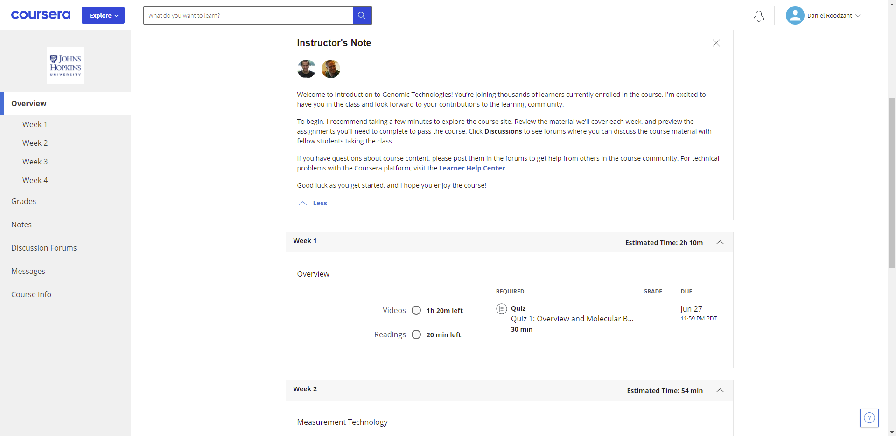

Looking ahead {.unnumbered}
================================================================================
In 2 years time I want to be working as a data scientist for a research group most preferably in the field of genomics or proteomics. My first big step and also my first big inspiration in regards to bioinformatics and data science is creating this digital portfolio as a result of the minor Data Science For Biology at the University of Applied Science Utrecht. 
   
The next skill for me to learn would be expanding my coding knowledge wherever necessary. I will start this by getting online certificates through the [Coursera](https://www.coursera.org/) platform. Here, institutes like universities but also Google and IBM offer courses, certificate programs and degrees in a number of fields including data science. 
  
The first course I will participate in is the [Genomic Data Science](https://www.coursera.org/specializations/genomic-data-science?action=enroll) specialization including 8 courses covering genomic data science tools, working with Python for genomics and algorithms. 
    
After signing up you will be lead to a screen containing videos, readings and quizzes devided into weeks with an average workload of 1-2 hours.
