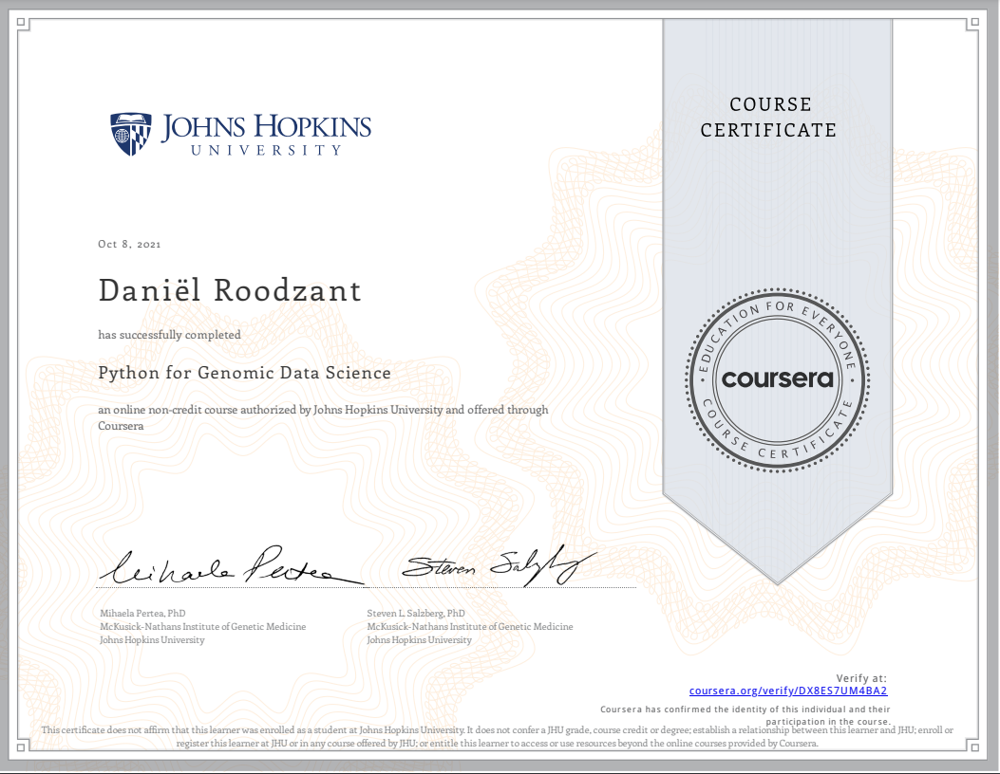

# Looking ahead 

In 2 years time I want to be working as a data scientist specializing in data engineering. My first big step and also my first big inspiration in regards to bioinformatics and data science is creating this digital portfolio as a result of the minor Data Science For Biology at the University of Applied Science Utrecht. The project for the PMC where I created an R-Shiny dashboard awakened an interest in data engineering, development of software and scriptwriting. 
   
The next skill for me to learn would be expanding my coding knowledge wherever necessary. I have already started this by getting online certificates through the [Coursera](https://www.coursera.org/) platform. Here, institutes like universities but also Google and IBM offer courses, certificate programs and degrees in a number of fields including data science. 
  
One of the courses I participated in is the [Genomic Data Science](https://www.coursera.org/specializations/genomic-data-science?action=enroll) specialization including 8 courses covering genomic data science tools, working with Python for genomics and algorithms. 
    
After signing up Coursera grants you acces to pages containing videos, readings and quizzes divided into weeks with an average workload of 1-2 hours.  
{width=100%}
 
Upon completion of the course and after taking some exams you are presented with a certificate.  
{width=100%}