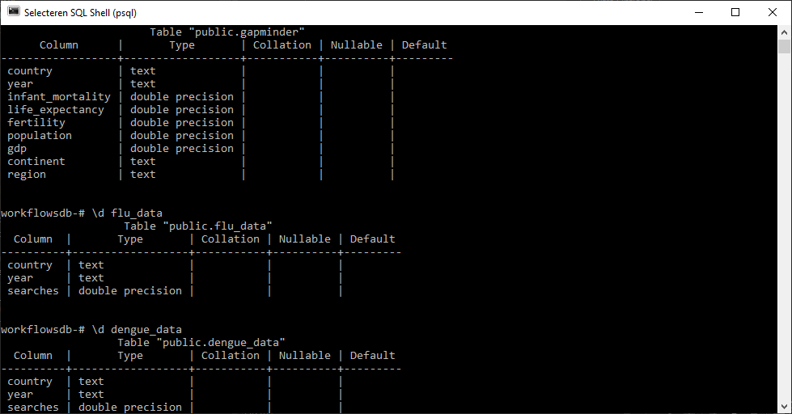
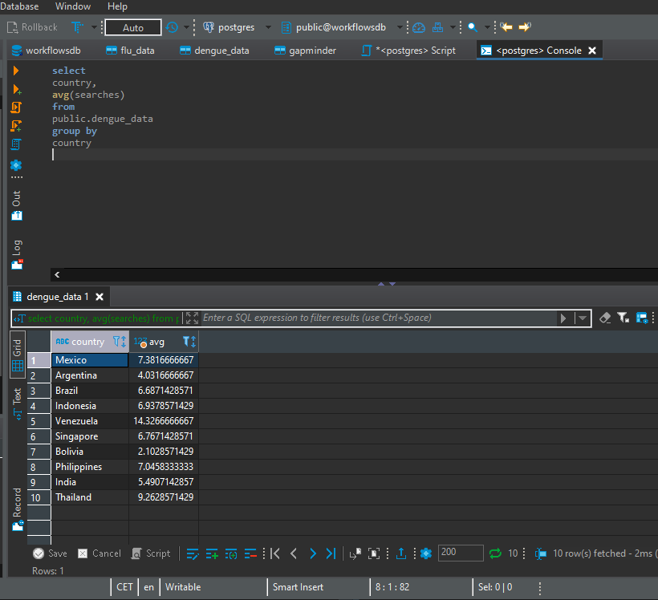

# Relational databases 


## Intro 

This page is about datasets on flu and dengue occurrences between 2002 and 2015 as measured by Google Webservices "Google Flu Trends" and "Google Dengue Trends". These webservices track searches of the words flu and dengue in different countries and match them to occurrences of the diseases in these countries. The data will be compared to the "gapminder" dataset that is part of the R package dslabs.
<br> <br> 
Data Source: <br>
(Google sites are unfortunately no longer operational) <br>
- Google Flu Trends (http://www.google.org/flutrends) <br>
- Google Dengue Trends (http://www.google.org/denguetrends) <br>
- [dslabs package](https://www.rdocumentation.org/packages/dslabs/versions/0.7.4)
<br> <br> 
Datasets used: <br>
- [Flu data](data_raw/005_relational_databases/flu_data.csv) <br>
- [Dengue data](data_raw/005_relational_databases/dengue_data.csv) <br>
- [gapminder](data_raw/005_relational_databases/gapminder.csv)
<br>

## Cleaning up 

Before any comparisons can be made the data must be tidied and the column types must be matching. <br>
The gapminder dataset is also very large and includes a large number of years not present in the flu and dengue datasets. These years also need to be removed from the dataset. <br>
The next section will show how this was achieved:
<br>
```{r tidyup, message = FALSE, warning = FALSE}
# Load the datasets into R datframes
flu_data <- utils::read.csv(here::here("data/data_raw/005_relational_databases/flu_data.csv"), skip = 11) %>%
                              dplyr::as_tibble()
dengue_data <- utils::read.csv(here::here("data/data_raw/005_relational_databases/dengue_data.csv"), skip = 11) %>%
                                 dplyr::as_tibble()
gapminder <- dslabs::gapminder %>% as_tibble()

# Tidy the flu_data and dengue_data datasets
flu_data <- flu_data %>% 
  tidyr::pivot_longer(cols = Argentina:Uruguay,
                      names_to = "country", 
                      values_to = "searches"
                      )
dengue_data <- dengue_data %>% 
  tidyr::pivot_longer(cols = Argentina:Venezuela,
                      names_to = "country", 
                      values_to = "searches"
                      )

# Match the column types of the datasets
# The coltrans() function is from the drporthelp package that was created for this portfolio
flu_data <- drporthelp::coltrans(flu_data)
dengue_data <- drporthelp::coltrans(dengue_data)

gapminder <- gapminder %>%
  base::transform(year = as.character(year))

# Filter gapminder to contain only the years present in the flu and dengue dataseets
gapminder <- gapminder %>% 
  dplyr::filter(year %in% c(2002:2015))
```

## Using DBeaver SQL 

Following the cleaning of the data, the datasets need to be saved in R and uploaded to DBeaver for further review using the following commands:
<br>
```{r DBeaver saving, eval = FALSE}
#Save the data in .csv and .rds files
utils::write.csv(flu_data, "data/data_raw/005_relational_databases/flu_data_tidy.csv")
utils::write.csv(dengue_data, "data/data_raw/005_relational_databases/dengue_data_tidy.csv")
utils::write.csv(gapminder, "data/data_raw/005_relational_databases/gapminder.csv")
readr::write_rds(flu_data, "data/data_raw/005_relational_databases/flu_data_tidy.rds")
readr::write_rds(dengue_data, "data/data_raw/005_relational_databases/dengue_data_tidy.rds")
readr::write_rds(gapminder, "data/data_raw/005_relational_databases/gapminder.rds")

#Upload the data to DBeaver, con = the DBeaver connection created using the DBI::dbConnect() function
DBI::dbWriteTable(con, "flu_data",
             flu_data,
             overwrite = TRUE
              )
DBI::dbWriteTable(con, "dengue_data",
             dengue_data,
             overwrite = TRUE
              )
DBI::dbWriteTable(con, "gapminder",
             gapminder,
             overwrite = TRUE
              )
```
<br>
Uploading files into DBeaver can come in handy to do things like: <br>
Using the SQL shell to obtain some information about the data in the tables <br>
{width=100%}
<br>
Using the console to get information from the data
{width=100%}

## Joining the data 

Getting information from tables and forming them into something useful for visualizing data can also be done using R.
The Data needs to be joined together to make good informative figures. The next section shows how this was done followed by a preview of the newly formed table.
<br>
```{r join tables, message = FALSE, warning = FALSE}
# Make the data tables joinable
# The datatrans() function is from the drporthelp package that was created for this portfolio
flu_data <- drporthelp::datatrans(flu_data)
dengue_data <- drporthelp::datatrans(dengue_data)

# Join the data tables
flu_dengue_data <- dplyr::full_join(flu_data, 
                                    dengue_data, 
                                    by = c("country", "year"), 
                                    suffix = c("_flu", "_dengue")
                                    )
gap_flu_dengue_data <- dplyr::inner_join(flu_dengue_data, 
                                         gapminder, 
                                         by = c("country", "year")
                                         )
knitr::kable(gap_flu_dengue_data %>% head(5))
```

## Visualising the data 

After the data is joined together in one table it can be udes to create some figures:
<br> <br> 
First by plotting the occurrences of flu and dengue per region to see if they are more common in one region compared to the other. 
<br> 
```{r data visualisation 1, message = FALSE, warning = FALSE}
# plot occurrences of flu and dengue per region
flu_region <- gap_flu_dengue_data %>% 
  ggplot2::ggplot() + 
  geom_col(aes(x = region, 
               y = searches_flu,
               fill = region)
           ) +
  theme(axis.text.x = element_text(angle = 45, hjust = 1),
        legend.position = "none"
        ) + 
  labs(title = "Flu searches per region", 
       subtitle = "Searches of the word 'Flu' per region",
       x = "",
       y = "Searches"
       )

dengue_region <- gap_flu_dengue_data %>% 
  ggplot2::ggplot() + 
  geom_col(aes(x = region, 
               y = searches_dengue,
               fill = region)
           ) +
    theme(axis.text.x = element_text(angle = 45, hjust = 1),
          legend.position = "none"
        ) + 
  labs(title = "Dengue searches per region", 
       subtitle = "Searches of the word 'Dengue' per region",
       x = "",
       y = "Searches"
       )

gridExtra::grid.arrange(flu_region, dengue_region, nrow = 1)
```
<br>
The data shows that dengue is most common in South America and South-Eastern Asia. It also has some presence in Central America and Southern Asia but not so much in other regions.
<br>
Flu appears to be most common in Eastern Europe, Western Europe and Northern America. Regions where it's not very common are North- and Southern Europe and South America
<br> <br>
The second graph will portray the occurrences of flu and dengue in the Netherlands over the period of 2002 to 2015.
<br>
```{r data visualisation 2, message = FALSE, warning = FALSE}
# plot occurrences of flu and dengue in the Netherlands by year
flu_region <- gap_flu_dengue_data %>% 
  dplyr::filter(country == "Netherlands") %>% 
  ggplot2::ggplot() + 
  geom_col(aes(x = year, 
               y = searches_flu,
               fill = year)
           ) +
  theme(axis.text.x = element_text(angle = 45, hjust = 1),
        legend.position = "none"
        ) + 
  labs(title = "Flu searches in the Netherlands", 
       subtitle = "Searches of the word 'Flu' in the Netherlands",
       x = "Year",
       y = "Searches"
       )

dengue_region <- gap_flu_dengue_data %>% 
  dplyr::filter(country == "Netherlands") %>%
  ggplot2::ggplot() + 
  geom_col(aes(x = year, 
               y = searches_dengue,
               fill = year)
           ) +
    theme(axis.text.x = element_text(angle = 45, hjust = 1),
          legend.position = "none"
        ) + 
  labs(title = "Dengue searches in the Netherlands", 
       subtitle = "Searches of the word 'Dengue' in the Netherlands",
       x = "Year",
       y = "Searches"
       )

gridExtra::grid.arrange(flu_region, dengue_region, nrow = 1)
```
<br> 
The flu had its most occurrences in 2009 and 2013 and its least in 2004 and 2010. There is no flu data for 2002 and 2003. This could be because of a lack of data in these years. <br>
The data shows that Dengue has had no occurrences in the Netherlands between 2002 and 2015.
<br> <br> 
The third and last graph will show the worldwide occurrences of flu and dengue on a year to year basis. Showing what years these diseases were most common.
<br>
```{r data visualisation 3, message = FALSE, warning = FALSE}
# plot occurrences of flu and dengue per year
flu_region <- gap_flu_dengue_data %>% 
  ggplot2::ggplot() + 
  geom_col(aes(x = year, 
               y = searches_flu,
               fill = year)
           ) +
  theme(axis.text.x = element_text(angle = 45, hjust = 1),
        legend.position = "none"
        ) + 
  labs(title = "Flu searches per year", 
       subtitle = "Worldwide searches of the word 'Flu'",
       x = "Year",
       y = "Searches"
       )

dengue_region <- gap_flu_dengue_data %>% 
  ggplot2::ggplot() + 
  geom_col(aes(x = year, 
               y = searches_dengue,
               fill = year)
           ) +
    theme(axis.text.x = element_text(angle = 45, hjust = 1),
          legend.position = "none"
        ) + 
  labs(title = "Dengue searches per year", 
       subtitle = "Worldwide searches of the word 'Dengue'",
       x = "Year",
       y = "Searches"
       )

gridExtra::grid.arrange(flu_region, dengue_region, nrow = 1)
```
<br>
The Flu had its most occurrences in 2009, same as in the Netherlands as shown in the previous graph. The least occurrences were in 2002, 2003 and 2004. This could be because of a lack of data in these years. The rest of the datapoints show only minor peaks. <br>
Dengue had its most occurrences in 2009 and 2010, and the least in 2002, 2003 and 2015. This could also be because of a lack of data in the first, and last few years of the survey.
