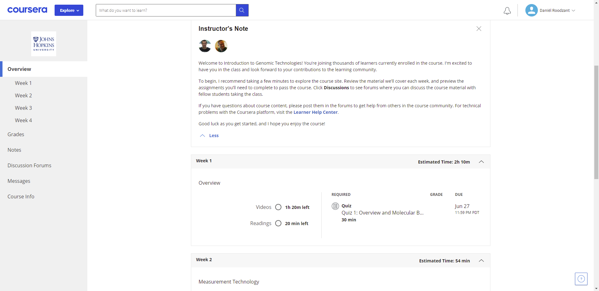

# Looking ahead 

In 2 years time I want to be working as a data scientist specializing in data engineering or software development. My first big step, and also my first big inspiration in regards to bioinformatics and data science is creating this digital portfolio as a result of the minor Data Science For Biology at the University of Applied Science Utrecht. The project for the PMC where I created an R-Shiny dashboard, that was discussed in [chapter 5](https://danielroodzant.github.io/dsfb2_workflows_portfolio/projecticum-princes-maxima-center.html) of this portfolio, awakened an interest in data engineering, software development and scriptwriting. The experience gained during this minor will be a great way to kick-start a career in data science.
<br> <br>
The next skill for me to learn would be expanding my coding knowledge wherever necessary. I have already started this by getting online certificates through the [Coursera](https://www.coursera.org/) platform. Here, institutes like universities but also Google and IBM offer courses, certificate programs and degrees in a number of fields including data science. 
<br><br>
One of the courses I participated in is the [Genomic Data Science](https://www.coursera.org/specializations/genomic-data-science?action=enroll) specialization including 8 courses covering genomic data science tools, working with Python for genomics and algorithms. I chose this particular course because it lines up great with my education in life sciences and data science. It will also give me a good introduction to working with Python which will be greatly beneficial to my career. 
<br> <br> 
After signing up, Coursera grants you access to pages containing videos, readings and quizzes divided into workweeks with an average workload of 1-2 hours per week. <br>
{width=100%}
<br>
Some of the course material, for example, consisted of reading genomes from Fasta lines and transforming the genome to its reverse complement:
```{python}
# create a function reading genome strings from FASTA lines
def readGenome(filename):
    genome = ''
    with open(filename, 'r') as f:
        for line in f:
            # ignore header line with genome information
            if not line[0] == '>':
                genome += line.rstrip()
    return genome

# use function and view first 25 characters
genome = readGenome("data_raw/007_looking_ahead/lambda_virus.fa")
print(genome[0:24])
```
```{python}
# create function turning genome into its reverse complement
def reverseComplement(s):
    complement = {'A': 'T', 'C': 'G', 'G': 'C', 'T': 'A', 'N': 'N'}
    t = ''
    for base in s:
        t = complement[base] + t
    return t
  
# use function and view first 25 characters
genome_reverse = reverseComplement(genome)
print(genome_reverse[0:24])
```
<br>
Upon completion of the course and after taking some exams you are presented with a certificate. <br>
{width=100%}
<br><br>
Another skill that I would love to pick up for my future career is learning Java. Java is used a lot in software development and would therefore be a great addition to my skillset.